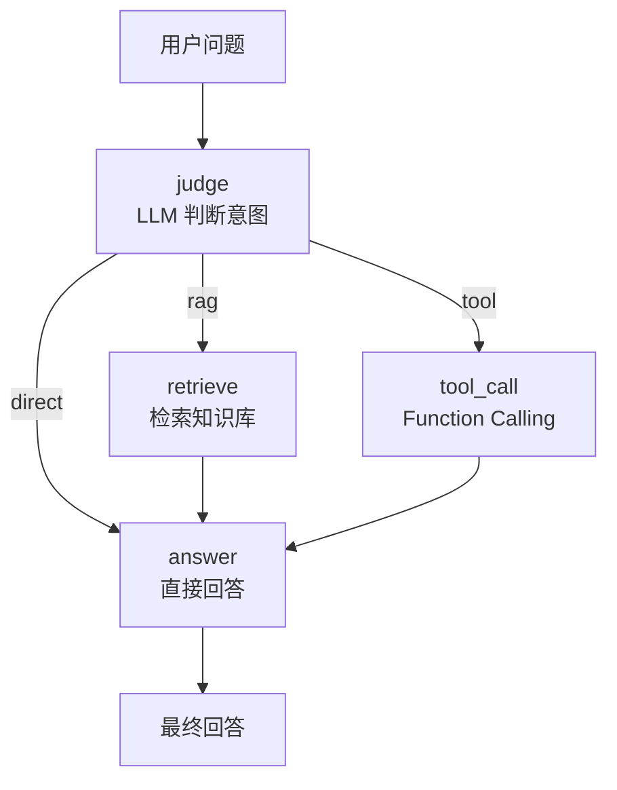

# Agentic RAG Demo

用 **LangGraph 状态机**实现的 Agentic-RAG 最小可运行示例：让 Agent 自主判断一个问题该走「检索知识库」、「调用工具」还是「直接回答」，而不是无脑套一条固定 RAG 流水线。

## 它和普通 RAG 的区别

普通 RAG 是单向管道：`问题 → 检索 → 拼上下文 → 生成`，**不管问题需不需要检索**。

这个项目在检索前加了一个 **judge 判断节点**，由大模型决定路由；需要算数或取时间时，走 **Function Calling** 真正调用工具，而不是让模型"心算"。



## 核心实现

### 1. judge：让模型只输出一个词

```python
resp = llm.invoke(prompt)   # 只允许输出 rag / tool / direct
act = resp.content.strip()
```

路由用 LangGraph 的条件边实现：

```python
workflow.add_conditional_edges("judge", route_func)   # rag → retrieve, tool → tool_call, 其他 → answer
workflow.add_edge("retrieve", "answer")
workflow.add_edge("tool_call", "answer")
```

### 2. tool_call：Function Calling 而非提示词模拟

工具用标准 OpenAI function 描述定义，交给 `bind_tools`：

```python
tools = [{"type": "function", "function": {
    "name": "calculator",
    "description": "数学加减乘除计算",
    "parameters": {"type": "object", "required": ["a", "b", "op"],
                   "properties": {"a": {"type": "number"}, "b": {"type": "number"},
                                  "op": {"type": "string", "enum": ["add","sub","mul","div"]}}}}]

resp = llm.bind_tools(tools).invoke(messages)   # 模型输出 tool_calls
```

当前注册两个工具：

| 工具 | 作用 |
|---|---|
| `calculator` | 四则运算，除零返回明确错误 |
| `get_current_time` | 获取系统当前时间 |

### 3. 可视化 Agent 执行链路

程序启动时会用 LangGraph 自带的图导出功能打印 Mermaid 流程图：

```python
app.get_graph().draw_mermaid()   # 由 print_mermaid_graph() 调用
```

## 快速开始

```bash
pip install langgraph langchain langchain-openai python-dotenv

# 配置密钥（当前仓库未提供 .env.example，需自行创建）
echo DEEPSEEK_API_KEY=你的密钥 > .env

python src/main.py
```

启动后先打印 Mermaid 流程图，然后进入交互循环，输入问题即可；输入 `exit` 退出。每次回答会同时打印 `thought`、`action`、检索到的上下文、工具执行结果和最终回答——方便观察 Agent 到底走了哪条分支。

## 目录结构

```text
agentic-rag-demo/
├── src/main.py        # 状态图定义、工具定义、四个节点、交互主循环
├── pyproject.toml     # 项目元数据与依赖声明
└── README.md
```

单文件实现，适合作为理解 Agentic-RAG 的起点。

## 已知问题

- `model="deepseek-chat"` 是早期写法，若运行时报「模型不存在」，请按 DeepSeek 官方文档替换为当前可用的模型 id。
- `pyproject.toml` 中的包名与 `python-dotenv` 依赖名混入了非 ASCII 的连字符（U+2011），**直接安装会失败**，需替换为普通 `-`。
- 知识库目前是源码里的一段硬编码字符串（`knowledge_base`），用于演示路由逻辑；接入真实向量检索（如 Chroma / FAISS）是下一步。
- 缺少 `.env.example`；`pyproject.toml` 的 `authors` 仍是占位符 `your-name`。

## 后续可做

- 把 `knowledge_base` 换成 Chroma / FAISS 向量库，做成真正的检索增强。
- 检索分支增加重排（rerank）与引用来源输出。
- 为工具调用增加失败重试与参数校验。
- 加一层简单的评测集，量化 judge 路由的准确率。
