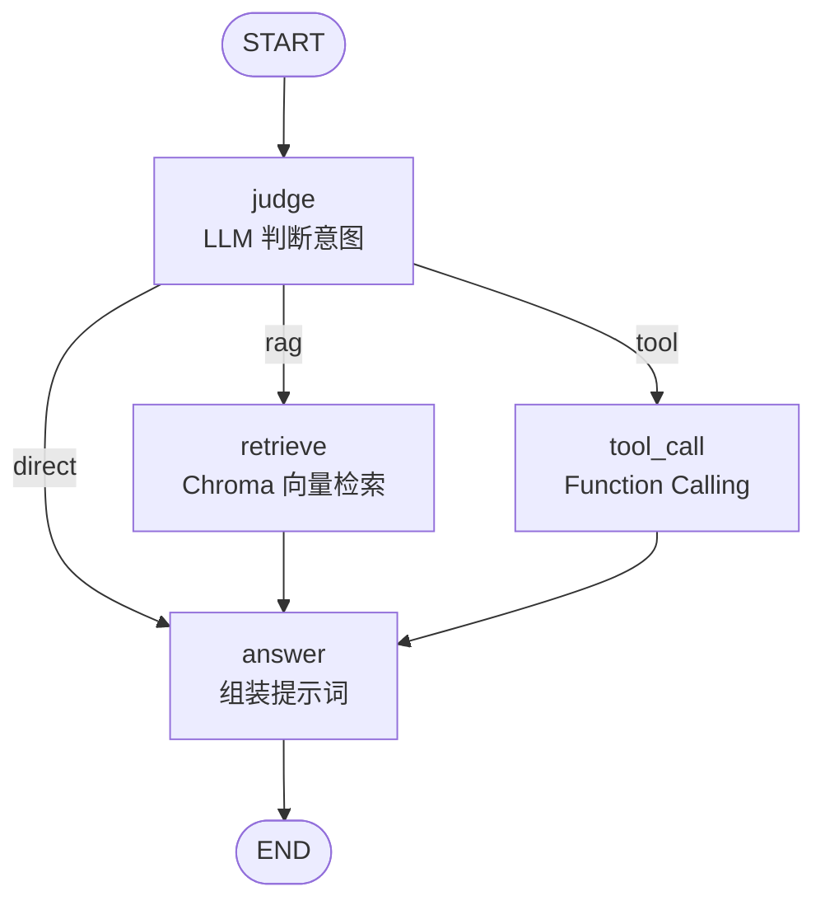

# Agentic-RAG Demo

用 **LangGraph 状态机**实现的 Agentic-RAG 示例：让 Agent 自主判断一个问题该走「检索知识库」、「调用工具」还是「直接回答」，而不是无脑套一条固定 RAG 流水线。

- 检索分支接 **Chroma 向量库**，语料分块后按语义相似度召回 Top-K，并在回答里标注引用来源
- 工具分支走**真实 Function Calling**（`bind_tools`），不是让模型用提示词"心算"
- 无 API key 也能跑通检索层与测试（Chroma 用内置本地 embedding 模型）

## 它和普通 RAG 的区别

普通 RAG 是单向管道：`问题 → 检索 → 拼上下文 → 生成`，**不管问题需不需要检索**。

这个项目在检索前加了一个 **judge 判断节点**，由大模型决定路由；需要算数或取时间时，走 Function Calling 真正调用工具。

## 状态图



程序启动时会打印由 LangGraph 导出的真实图结构：

```python
app.get_graph().draw_mermaid()
```

## 核心实现

### 1. judge：路由决策 + 输出校验

judge 只允许模型输出一个单词：

```python
raw = resp.content
action = normalize_action(raw)   # 规整为 rag / tool / direct
if action is None:
    action = "direct"            # 兜底，但会带上 warning 打印出来
    warning = f"judge 返回了无法识别的决策 {raw!r}"
```

`normalize_action()` 会去掉引号、空白和句读，并容忍模型多输出一句话（取其中第一个合法动作词）。**识别不了时不会静默降级**——主循环会把 warning 打出来，方便定位是提示词问题还是模型问题。

路由用 LangGraph 的条件边实现，未知值一律落到 `answer`：

```python
workflow.add_conditional_edges(
    "judge", route_func,
    {"retrieve": "retrieve", "tool_call": "tool_call", "answer": "answer"},
)
```

### 2. retrieve：Chroma 向量检索 + 引用来源

语料在 `src/retriever.py` 里按「一个知识点一条」切分成 12 条，启动时写入 Chroma（余弦空间），检索时按语义相似度召回 Top-K：

```python
result = collection.query(query_texts=[query], n_results=top_k)
score = 1.0 - float(distance)        # cosine 空间下 distance = 1 - 相似度
```

召回片段会拼成带来源标记的上下文，回答时要求模型用 `[来源: kb#03]` 标注依据：

```python
context = "\n".join(f"[{c.source}] {c.text}" for c in chunks)
```

embedding 用的是 Chroma 内置的本地 ONNX 模型（`all-MiniLM-L6-v2`），**不需要额外的 embedding API key**。

### 3. tool_call：Function Calling 而非提示词模拟

工具用标准 OpenAI function 描述定义，交给 `bind_tools`：

```python
resp = llm.bind_tools(TOOL_SCHEMAS).invoke(messages)   # 模型输出 tool_calls
```

当前注册两个工具：

| 工具 | 作用 |
|---|---|
| `calculator` | 四则运算，除零返回明确错误 |
| `get_current_time` | 获取系统当前时间 |

一次响应里的**所有** `tool_calls` 都会被依次执行；工具名未知或参数不合法时返回可读的错误文本，而不是抛异常。模型没有选择调用工具时，answer 节点会明确说明拿不到工具结果，而不是拿空字符串硬编。

### 4. answer：三条分支共用

按 `action` 组装不同提示词。检索分支如果没召回任何片段、工具分支如果没拿到结果，都会**直接给出"无法回答"**，不进入生成环节。

## 快速开始

需要 Python >= 3.10。

```bash
git clone https://github.com/Shui1Jiao/agentic-rag-demo.git
cd agentic-rag-demo

python -m venv .venv
# Windows
.venv\Scripts\activate
# macOS / Linux
source .venv/bin/activate

pip install -r requirements.txt

# 配置密钥
cp .env.example .env        # Windows: copy .env.example .env
# 编辑 .env，填入 DEEPSEEK_API_KEY

python -m src.main
```

启动后会先打印状态图的 Mermaid 代码、初始化向量库，然后进入交互循环。输入问题即可，输入 `exit` 退出。

> **首次运行会下载 embedding 模型**（约 80MB，缓存到本地后不再重复下载），需要联网。这一步发生在初始化向量库时。

每次回答会同时打印 `thought`、`action`、引用来源、检索到的上下文、工具执行结果和最终回答——方便观察 Agent 到底走了哪条分支。

### 环境变量

| 变量 | 必填 | 默认值 | 说明 |
|---|---|---|---|
| `DEEPSEEK_API_KEY` | 是 | 无 | DeepSeek API 密钥 |
| `DEEPSEEK_MODEL` | 否 | `deepseek-chat` | 模型名，官方调整命名时改这里即可，不用动代码 |
| `DEEPSEEK_BASE_URL` | 否 | `https://api.deepseek.com/v1` | 接口地址 |

## 测试

检索层的冒烟测试不需要 API key：

```bash
pip install -e ".[dev]"
python -m pytest tests -q
```

覆盖：索引条数、检索相关性排序、空查询、judge 输出规整、条件边兜底。

## 目录结构

```text
agentic-rag-demo/
├── src/
│   ├── __init__.py
│   ├── main.py          # 状态图、工具定义、四个节点、交互主循环
│   └── retriever.py     # 语料分块 + Chroma 索引 + 语义检索
├── tests/
│   └── test_smoke.py    # 检索层与路由逻辑冒烟测试
├── .env.example         # 环境变量模板
├── requirements.txt
├── pyproject.toml
├── LICENSE
└── README.md
```

## 已知限制

- 语料是 12 条演示知识点，覆盖 Agentic-RAG / LangGraph / 向量检索等概念，**不是真实业务知识库**。
- 没有 rerank 重排，直接取向量召回结果。
- 没有评测集，judge 路由准确率尚未量化。
- 检索分支的拒答判断只基于「是否召回片段」，没有做相关性阈值过滤——相似度很低时仍会拿片段去回答。

## 后续可做

- 用 `.with_structured_output()` 把 judge 的决策约束成枚举，比字符串校验更稳。
- 检索分支增加 rerank 与相似度阈值过滤。
- 加一层评测集，量化 judge 路由准确率与检索召回率。
- 支持多轮对话（把历史写进 LangGraph 状态并加 checkpointer）。
